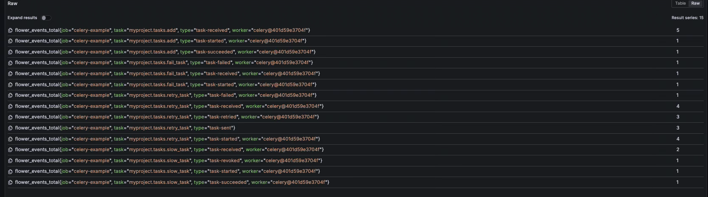

# Celery + Django + OpenTelemetry Example

Minimal Django project demonstrating the Celery instrumentation with both
**task-level tracing/metrics** and **worker lifecycle metrics**.

## Prerequisites

- Docker (for Redis, Grafana LGTM stack, and optionally the app itself)
- The monorepo installed: `uv sync --frozen --all-packages` from the repo root
  (only needed for the "local" workflow)

## Docker Compose (recommended)

Everything — Redis, Grafana/OTel collector, Celery worker, and Django — runs
in containers.  The monorepo is bind-mounted and `uv sync` runs once in an
init container.

```bash
cd instrumentation/opentelemetry-instrumentation-celery/example
docker compose up -d

# Exercise every metric path
docker compose run --rm -w /repo django \
    uv run --no-sync \
        --directory instrumentation/opentelemetry-instrumentation-celery/example \
        python exercise_metrics.py

# Or hit the endpoints manually
curl http://localhost:8000/add/
curl http://localhost:8000/fail/
```

Open **Grafana** at <http://localhost:3000> (user/pass: `admin`/`admin`) and
explore metrics prefixed with `flower.*`.



```bash
# Tear down
docker compose down -v
```

## Local workflow (no containers for app)

```bash
# 1. Start Redis + Grafana
docker compose up -d redis grafana-otel-lgtm

# 2. Start the Celery worker (from the repo root)
cd ../../..
uv run --directory instrumentation/opentelemetry-instrumentation-celery/example \
    celery -A myproject worker --loglevel=info

# 3. In another terminal, start Django dev server
uv run --directory instrumentation/opentelemetry-instrumentation-celery/example \
    python manage.py runserver

# 4. Fire tasks
curl http://localhost:8000/add/
curl http://localhost:8000/fail/

# 5. Or run the exercise script
uv run --directory instrumentation/opentelemetry-instrumentation-celery/example \
    python exercise_metrics.py
```

## What to expect

- The **Celery worker terminal** prints spans to the console (via
  `ConsoleSpanExporter`) for each task publish, run, failure, and retry.
- Traces **and** metrics are exported via OTLP to the Grafana LGTM stack
  (reads `OTEL_EXPORTER_OTLP_ENDPOINT`, defaults to `http://localhost:4317`).
- Task metrics (`flower.events.total`, `flower.task.runtime.seconds`, etc.)
  are exported every 5 seconds.
- Worker lifecycle metrics (`flower.worker.online`) are tracked via
  `CeleryWorkerInstrumentor`.

## Endpoints

| URL | Description |
|-----|-------------|
| `GET /add/` | Enqueue an `add(4, 6)` task |
| `GET /fail/` | Enqueue a task that raises `ValueError` |

## Cleanup

```bash
docker compose down -v
```
